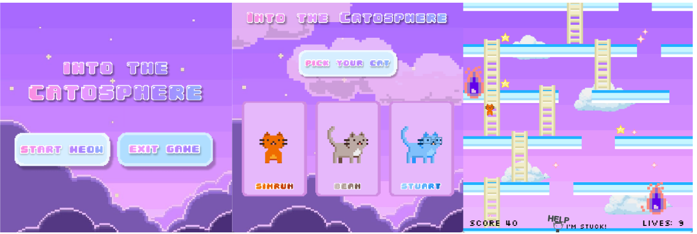
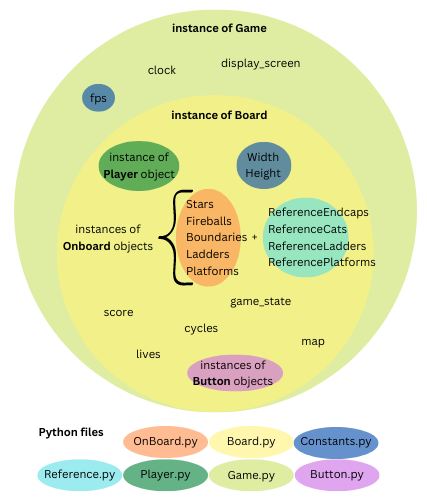
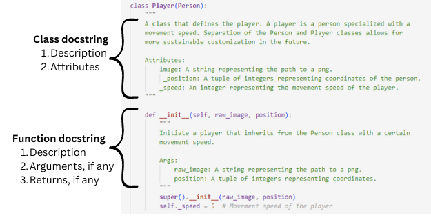

# Into the Catosphere

## For Players...
### Introduction
Our game “Into the Catosphere” is a game where you follow a cat’s journey to space by helping the cat collect stars, avoid fireballs and navigate in the right direction. It is a simple platform game where you can interact with the platforms and ladders on the gameboard and move in all four directions. The objective of the game is collect as many stars as possible without losing lives. For more information, visit our <a href="https://serencha.github.io/catosphere/" target="_blank">website</a>.

### Installation and Usage
* Executing our game requires the installation of certain Python libraries. Download the required packages by running the commad `pip install -r requirements.txt` from within the project directory.
* Run `python main.py` to start the game.

### Instructions for Playing:
* Stay alive as long as you can while collecting stars and avoiding fireballs
* Use arrow keys to move around and climb ladders
* Getting to the top of the screen will refresh the map and generate more stars

## For Collaborators...
### Software Architecture

### Making a Contribution

If you'd like to make a contribution to the development of our game, please see the following guidelines:

* Create your own branch of the repository and make your changes there. This will allow our project contributors to review your code as a pull request and make any comments or suggestions before pulling your changes into main. See below for more detailed instructions on how to do that.
    * Fork the repository
    * Clone your fork of the repository and add git@github.com:melodch/intothecatosphere.git as the remote upstream
    * Create a new branch. Use this command to create a new branch and switch to it: `git checkout -b branch-name`
    * Start coding!

* Format code to conform to the PEP 8 style guide. Any commits that you make will run an style check! To autoformat your code to this standard, install the autopep8 library and use the command `autopep8 -i script_name.py`

* Any functions that you add should make use of docstrings to ensure readability of this project. The image below illustrates what kind of information is contained in a docstring.

* Finally, create a pull request! See below for more detailed instructions on how to do that.
    * Visit the GitHub page for your fork of the project repository and click on the "Pull requests" tab
    * Set up the new PR with the following options:
        * base repository: USERNAME/intothecatosphere
        * base: main
        * compare: branch-name
        * Under "Reviewers", assign Serena (serencha), Simrun (simrunm) and I (melodch) as reviewers.

## Contributors
- Serena Chang, Babson College, schang2@babson.edu
- Melody Chiu, Olin College of Engineering, cchiu@olin.edu
- Simrun Mutha, Olin College of Engineering, smutha@olin.edu
